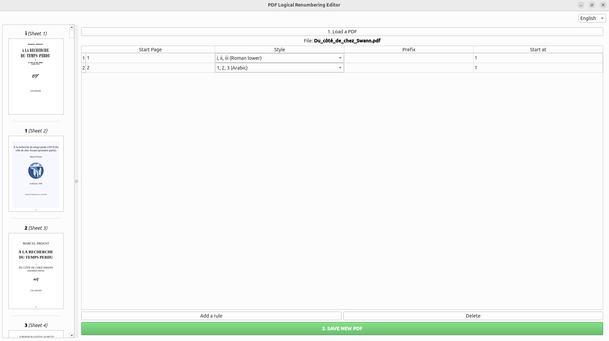
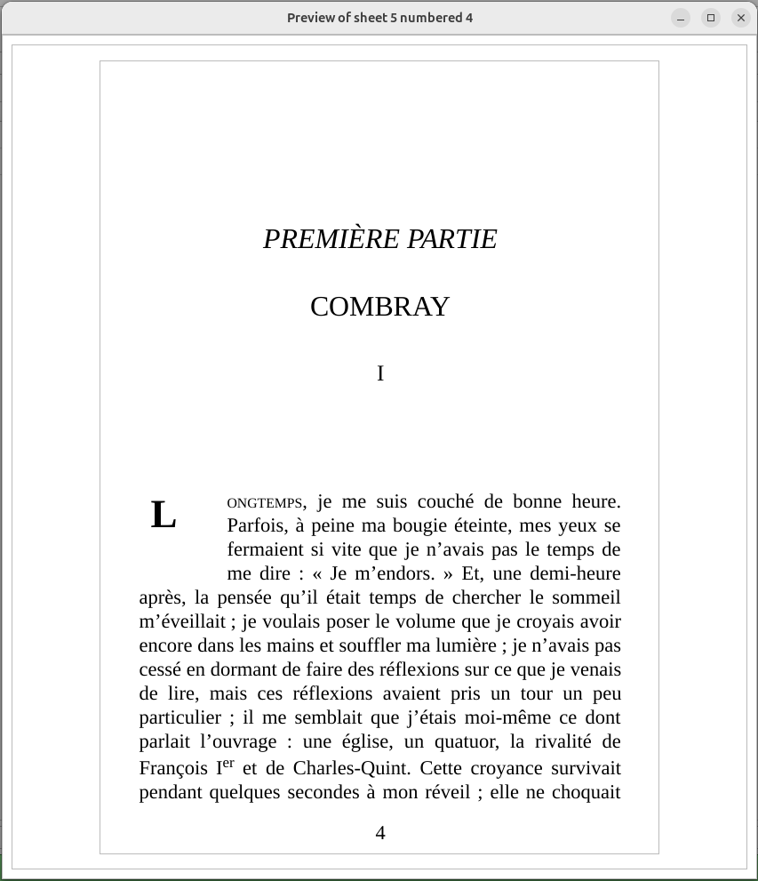

# PDF-Numerator
An open-source graphical tool (i18n) for **logical PDF page numbering** : replace logical numbering easily !

Ideal for technical documents, legal files, or books requiring complex numbering schemes (Roman, Arabic, Alpha).




## ✨ Features
- **Real-time Preview:** See the logical page label directly on thumbnails.
- **Multilingual (i18n):** Support for French, English, Spanish, and German.
- **Dynamic Interface:** Resizable sidebar with high-quality zoom (double-click).
- **Metadata Aware:** Automatically imports existing page labels from your PDF.

## 🚀 Installation (Linux/Ubuntu)
1. Install dependencies:
   ```bash
   pip install PyQt6 PyMuPDF```
   
2. Run the application :
   ```bash
   python3 main.py```

## 🛠 Tech Stack
    Python 3
    PyQt6 for the GUI
    PyMuPDF (fitz) for PDF manipulation
